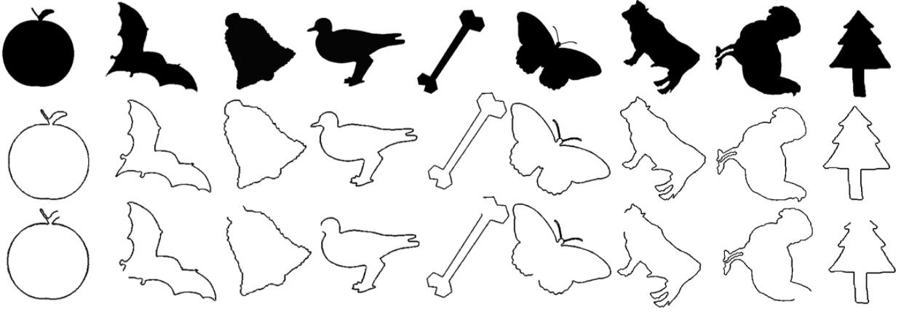

# Demo
## Abstract

We present a quantitative approach to measuring dissimilarity between simple curves. Using the slope change chain code, a curve is assigned to an invariant representation under translation, rotation, and scale.  The different curves to be compared are normalized to have the same amount of information (equal number of segments). In order to calculate the difference between two simple curves, it is proposed to generate sub-chains of the concave and convex changes along both curves. The dissimilarity value is the average of the differences between the sub-chains. The proposed methodology allows to grant a normalized value continuously from 0 to 1. We present some results of the calculation of the proposed measure for nine simple curves. To analyze our methodology, the dissimilarity matrix is calculated in 99 simple curves and 40 closed curves. We conclude our presentation by demonstrating the usefulness of our methodology with a practical application.

    

